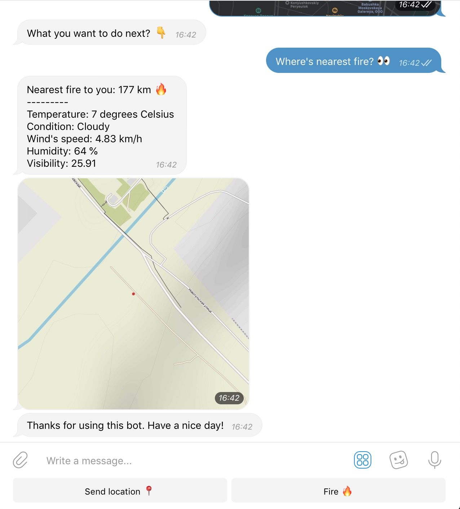

## FirefighterBot for Telegram

Implemented during [Space Apps 2018 Challenge](https://2018.spaceappschallenge.org) using data from NASA including [Active Fire Data](https://earthdata.nasa.gov/earth-observation-data/near-real-time/firms/active-fire-data) by NASA.

### Team "[Mommy's scientists](https://2018.spaceappschallenge.org/challenges/volcanoes-icebergs-and-asteroids-oh-my/real-time-fire-app/teams/mommys-scientists/project)"

<table>
    <tr>
        <td>
            
        </td>
        <td>
            <a href="https://www.facebook.com/profile.php?id=100021767708740">Alexander Boyko</a>
        </td>
    </tr>
    <tr>
        <td>
            
        </td>
        <td>
            <a href="https://www.facebook.com/yana.minaylova.3">Yana Minaylova</a>
        </td>
    </tr>
    <tr>
        <td>
            
        </td>
        <td>
            <a href="https://www.facebook.com/anton.karazeev">Anton Karazeev</a>
        </td>
    </tr>
</table>

### Screenshots

<table>
    <tr>
        <td>
            
        </td>
        <td>
            
        </td>
    </tr>
</table>
